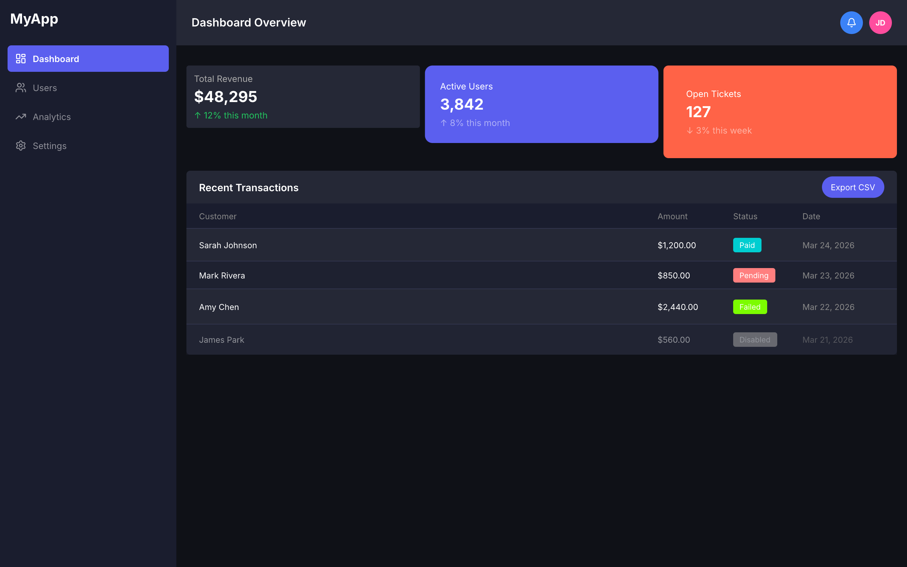
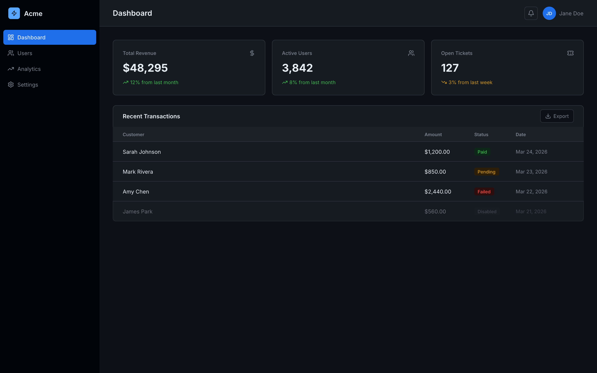

# PencilPlaybook

**Install once. Claude now knows why disabled buttons are 40% opacity, not 50%.**

That specificity — defensible, tested, perceptually grounded — is what separates production UI from AI slop. PencilPlaybook embeds those rules directly into Claude Code, so every Pencil.dev session automatically gets the values a senior designer carries in their head.

Now Claude knows:
- Disabled at **40%, not 50%** — MD3 and Workday both converged here after user testing; 50% creates visual competition with active elements
- Hover states need an **8% lightness delta** minimum — below that, the state is imperceptible on most monitors
- Body text on dark backgrounds: not pure white — halation makes it harder to read; use `#E2E8F0` or `#F1F5F9`
- Display type at 56px+: **−0.03em letter spacing** — optical counters open up at large sizes
- Touch targets: **44×44px minimum** on mobile, period

Nine scaffold archetypes. Seven preset design systems. Structured workflows for every Pencil.dev operation. One `git clone`.

---

<video src="https://github.com/stevembarclay/pencilplaybook/releases/download/v1.1.0/demo.mp4" controls width="100%"></video>

**Before** (raw Claude output) → **After** (with PencilPlaybook)

| Before | After |
|--------|-------|
|  |  |

---

## The rules Claude doesn't ship with

The problem isn't Claude's capability — it's that good design has specific, defensible values that AI doesn't know unless you tell it. Without them, it averages what it's seen on the internet.

These aren't opinions. They're the kind of thing a senior product designer learns from doing it wrong a few times. Hover states that don't clear the 8% lightness threshold are invisible on most monitors. Disabled elements at 50% opacity compete visually with active ones. Pure white on dark backgrounds causes halation. These are measurable, testable, reproducible failures — and they're exactly what raw Claude output defaults to.

PencilPlaybook embeds those values as lookup tables Claude checks before making any decision. It also gives Claude a structured workflow for `.pen` files: explore the canvas before touching it, inject brand tokens at session start, find empty space before placing a new screen, use bulk replacement tools for token propagation instead of clicking through nodes one by one.

The result: designs that are structurally sound and perceptually intentional — not averaged from what the internet thinks a dashboard should look like.

---

## Save Tokens & Go Faster

PencilPlaybook is built to reduce token waste and speed up your loops:

- Always start with **Canvas Archaeology**:
  `Using PencilPlaybook, analyze this canvas and list every screen + current design tokens.`

- Use scoped prompts for small changes:
  `Using PencilPlaybook, only update the modal on screen "checkout" with better hierarchy. Do not touch other screens.`

- Run **Bulk Property Inspection** first before big refactors.

- Stick to one of the 7 presets unless you have a very specific need.

Pro tip: Keep individual .pen files under ~15–20 screens. Use spatial management workflows when splitting large projects.

---

## Common Pitfalls & Fixes

- **MCP keeps disappearing or re-injecting**
  Run the setup wizard once, then pin the skill. Work primarily inside the IDE and avoid opening the Pencil desktop app while Claude Code is active — the app can override MCP configs.

- **Fear of losing work**
  Before any major change, prompt:
  `Using PencilPlaybook, create a version snapshot comment at the top of the canvas with current token values and screen list.`

- **Claude still suggests bad defaults**
  Always prefix prompts with `Using PencilPlaybook,`

- **Token spikes on large canvases**
  Use Canvas Archaeology + Bulk Inspection first.

---

## Quick Start

**Before you begin:** make sure [Pencil.dev](https://pencil.dev) is installed and open, and you have [Claude Code](https://claude.ai/code) installed.

**Step 1 — Install the skill** (pick one):

```bash
# Global — available in every project
git clone https://github.com/stevembarclay/pencilplaybook ~/.claude/skills/PencilPlaybook

# Per-project — only available in this repo
git clone https://github.com/stevembarclay/pencilplaybook .claude/skills/PencilPlaybook
```

**Step 2 — Run setup** (once, takes ~30 seconds):

```
In Claude Code, say: run the PencilPlaybook setup wizard
```

Pick a preset (Midnight, Ember, Grove, Bloom, Volt — or Material/Minimal if you're already using a design system) and you're done. Setup writes your design system config into the skill so Claude uses it automatically.

**Step 3 — Use it:**

```
Using PencilPlaybook, open my-design.pen and tell me what screens are in it.
```

That's it.

---

## What It Does

Five workflows Claude follows automatically when you reference `PencilPlaybook`:

| Workflow | When to use |
|---|---|
| **Canvas Archaeology** | "What's in this .pen file?" — explore before editing |
| **Design Token Propagation** | A color or font changed — push it across the file |
| **Canvas Spatial Management** | Adding a screen — find where to place it without overlap |
| **Style Guide Pull** | Building a page type you haven't designed before |
| **Bulk Property Inspection** | Audit for consistency before a token replacement |

Nine scaffold archetypes — ready-to-run `batch_design` scripts for every common layout: **Dashboard**, **List/Queue**, **Detail/Review**, **Marketing Page**, **Modal/Dialog**, **Wizard/Stepper**, **Mobile Screen**, **Form/Data Entry**, and **Empty State**.

**Perceptual Design Defaults** — science-backed lookup tables for typography, color contrast, spacing, motion, and icons. Built into the skill so Claude applies them automatically.

**Complete tool reference** for all 12 Pencil MCP tools — every parameter documented.

---

## Preset Design Systems

Five opinionated presets with distinct aesthetics, plus two baseline options if you're already working with an existing system:

| Preset | Primary | Fonts | Spacing | Dark? |
|---|---|---|---|---|
| **Midnight** | Electric blue (#58A6FF) | Inter / JetBrains Mono | Standard | Yes — full dark |
| **Ember** | Amber (#F59E0B) | JetBrains Mono / JetBrains Mono | Tight (6/12/20) | Yes — near-black |
| **Grove** | Forest green (#2D6A4F) | DM Sans / JetBrains Mono | Generous (12/20/32/48) | No — warm off-white |
| **Bloom** | Rose (#F43F5E) | Plus Jakarta Sans / JetBrains Mono | Standard | No — white |
| **Volt** | Near-black + yellow (#FACC15) | Space Grotesk / JetBrains Mono | Standard | No — white, black borders |

**Already have a design system?**

| Preset | Primary | Fonts | |
|---|---|---|---|
| **Material Design 3** | Purple (#6750A4) | Roboto / Roboto Mono | MD3 baseline |
| **Minimal / Neutral** | Near-black (#171717) | system-ui / ui-monospace | Blank slate |

Or answer 6 questions during setup to configure your own.

---

## Scaffold Archetypes

What each scaffold produces — run the setup wizard first to fill in your colors and dimensions.

```
A — Dashboard              B — List / Queue           C — Detail / Review
┌───────┬────────────────┐  ┌───────┬────────────────┐  ┌───────┬────────────────┐
│       │ PageHeader     │  │       │ PageHeader     │  │       │ PageHeader     │
│Sidebar│────────────────│  │Sidebar│────────────────│  │Sidebar│────────────────│
│       │ Stats KPIs     │  │       │ Search │Filter │  │       │ ActionBar      │
│       │────────────────│  │       │────────────────│  │       │────────────────│
│       │                │  │       │ Col Col Col Col│  │       │ Left  │ Right  │
│       │  ContentInner  │  │       │ ─────────────  │  │       │ Panel │ Panel  │
│       │                │  │       │ row · row · row│  │       │ (40%) │ (60%)  │
└───────┴────────────────┘  └───────┴────────────────┘  └───────┴────────────────┘

D — Marketing Page         E — Modal / Dialog         F — Wizard / Stepper
┌────────────────────────┐  ┌───────┬────────────────┐  ┌───────┬────────────────┐
│ Navbar                 │  │       │ PageHeader     │  │       │ PageHeader     │
├────────────────────────┤  │Sidebar│ ─ ─ ─ ─ ─ ─ ─ │  │Sidebar│────────────────│
│                        │  │(dim)  │  ┌──────────┐  │  │       │ ①──②──③──④    │
│     HeroSection        │  │       │  │ Header   │  │  │       │────────────────│
│                        │  │       │  │ Body     │  │  │       │                │
├────────────────────────┤  │       │  │[×][Save] │  │  │       │ ContentInner   │
│                        │  │       │  └──────────┘  │  │       │   (640px)      │
│     Section 1          │  │       │                │  │       │────────────────│
│                        │  └───────┴────────────────┘  │       │[← Back][Next →]│
└────────────────────────┘                               └───────┴────────────────┘

G — Mobile Screen          H — Form / Data Entry      I — Empty State
┌──────────────┐            ┌───────┬────────────────┐  ┌───────┬────────────────┐
│  StatusBar   │            │       │ PageHeader     │  │       │ PageHeader     │
├──────────────┤            │Sidebar│────────────────│  │Sidebar│────────────────│
│  NavBar      │            │       │ ┌────────────┐ │  │       │                │
├──────────────┤            │       │ │ FormSection│ │  │       │   ┌────────┐   │
│              │            │       │ │ [_________]│ │  │       │   │ illus. │   │
│ ScrollContent│            │       │ │ [_________]│ │  │       │   └────────┘   │
│              │            │       │ └────────────┘ │  │       │  "Nothing yet" │
├──────────────┤            │       │  [Cancel][Save]│  │       │  [+ Create one]│
│  BottomNav   │            └───────┴────────────────┘  └───────┴────────────────┘
└──────────────┘
   390 × 844
```

---

## Example Prompts

```
Using PencilPlaybook, propagate the color-primary change from #2D6A4F to #1B5E42 across dashboard.pen.
```

```
Using PencilPlaybook, scaffold a new List screen for the user management page.
```

```
Using PencilPlaybook, add a modal dialog to the existing invoice screen showing a delete confirmation.
```

```
Using PencilPlaybook, add a second screen to settings-v1.pen showing the edit state.
```

---

## File Structure

```
.claude/skills/pencilplaybook/
├── SKILL.md                   # Workflows, scaffolds, token map, session checklist
├── setup.md                   # Setup wizard — run once to configure
├── presets/
│   ├── midnight.json          # Full dark — electric blue, Inter
│   ├── ember.json             # Terminal dark — amber, JetBrains Mono
│   ├── grove.json             # Earthy light — forest green, DM Sans
│   ├── bloom.json             # Playful light — rose, Plus Jakarta Sans
│   ├── volt.json              # Neobrutalist — black borders, yellow accent
│   ├── material.json          # MD3 baseline
│   └── minimal.json           # Grayscale blank slate
└── references/
    └── tool-reference.md      # Full parameter docs + prompt recipes
```

---

## Contributing

Issues and PRs welcome. Particularly useful contributions:

- Additional presets — new personality-driven design systems (not framework defaults)
- Workflow additions (multi-file token sync, component extraction)
- Tool reference updates when Pencil MCP adds new tools
- Screenshots or recordings showing scaffold output before/after

---

## License

MIT — see [LICENSE](LICENSE).
